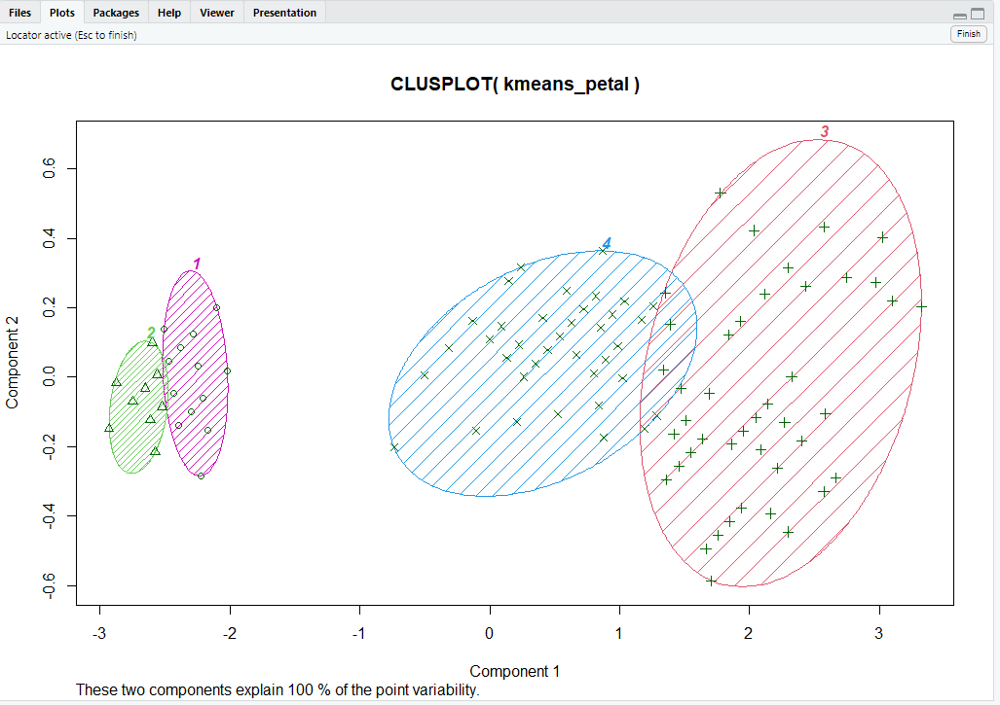

# K-Means Clustering Analysis with Iris Dataset

## Overview

This project demonstrates the use of the K-Means clustering algorithm to analyze and visualize patterns within the Iris dataset. By leveraging clustering techniques, the project identifies meaningful groupings of data points based on sepal and petal dimensions, showcasing the power of unsupervised learning in data science.

The project is implemented in R and serves as an example of how clustering methods can extract actionable insights from datasets, applicable to domains such as bioinformatics, customer segmentation, and socioeconomic analysis.

---

## Features

1. **Data Preparation**  
   - Load and clean the Iris dataset, ensuring proper structure and column naming.
   - Handle missing values to ensure robust analysis.

2. **Clustering with K-Means**  
   - Apply the K-Means algorithm to `sepal_length`, `sepal_width`, `petal_length`, and `petal_width` features.
   - Experiment with different numbers of clusters to identify optimal groupings.

3. **Visualization**  
   - Generate cluster plots using the `clusplot` function for both sepal and petal dimensions.
   - Use clear color coding and shading to distinguish between clusters.

4. **Analysis and Insights**  
   - Interpret clustering results to identify patterns and relationships within the data.
   - Provide recommendations for practical applications of the clustering results.

---

## Technology Stack

- **Programming Language**: R
- **Libraries Used**:
  - `tidyverse`: For data manipulation and visualization.
  - `cluster`: For clustering analysis and generating cluster plots.

---

## Installation and Setup

1. Clone the repository:
   ```bash
   git clone https://github.com/ewache04/K-Means-Clustering-Iris.git
   cd K-Means-Clustering-Iris
   ```

2. Ensure you have R installed on your system.

3. Install the required R packages:
   ```R
   install.packages("tidyverse")
   install.packages("cluster")
   ```

4. Load the R script `kmeans_clustering.R` into your R environment.

---

## How to Run

1. Load the dataset:
   Ensure the `iris.csv` file is located in your working directory.

2. Execute the script:
   Run the `kmeans_clustering.R` file in your R environment.

3. View Results:
   - Analyze the clustering output in your console.
   - Visualize clusters through the generated plots.

---

## Outputs

### Cluster Plots

#### Sepal Features
This plot shows three distinct clusters based on sepal dimensions, revealing groupings that align with Iris species categories.  


#### Petal Features
This plot highlights four refined clusters based on petal dimensions, providing deeper insights into species differentiation.  


---

### Key Insights
- Identified natural groupings in the Iris dataset, corresponding to different species.
- Demonstrated how clustering can be applied to analyze patterns and trends.

---

## Relevance

This project is part of my USCIS petition, demonstrating my ability to apply data science techniques to uncover meaningful patterns in complex datasets. Understanding such patterns is critical for my proposed AI-driven homelessness prevention initiative, where identifying at-risk populations through clustering can enable timely and targeted interventions.

---

## Contact Information

**Author**: Jeremiah Ochepo  
**Email**: jochepo4growth@gmail.com  
**GitHub Repository**: [K-Means Clustering Analysis](https://github.com/ewache04/Iris-Flower-Clustering-Model)

---

## License

This project is open-source and available under the [MIT License](LICENSE). Contributions and suggestions are welcome!